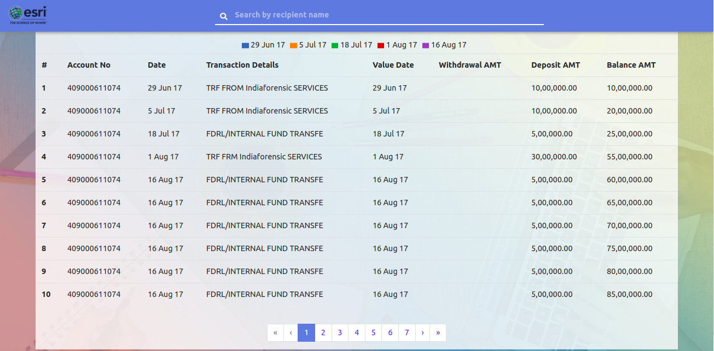
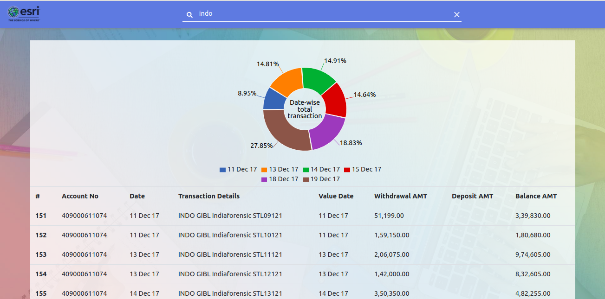
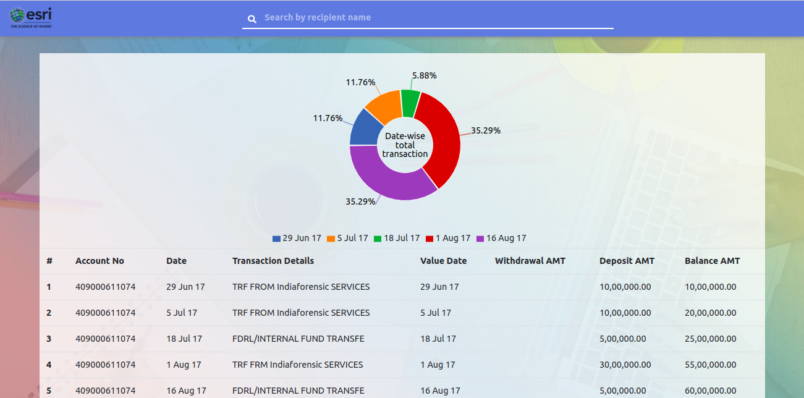

# esri-frontend | ESRI FRONTEND HIRING CHALLENGE
Develop a Frontend application that would display account and transaction details of a user.

## How to run the project online
Open the online demo [here](https://manish-dalal.github.io/esri-frontend)

## Features

- Use of Web API to fetch account details.
- API Parameters: \[Account No, Date, TransactionDetails, Value Date, Withdrawal AMT, Deposit AMT, Balance AMT]\.
- Visually interactive design to list details.
- Implement pagination on the frontend. Display 10 records max in a page.
- Zip all your Source code, Screenshots & detailed deployment instructions and upload.
- Implement charts, Pie charts, other visualization displaying different transaction patterns across time.
- Implement a Search functionality to search transaction details for a particular recipi-ent.

## GUIDE

- Bank Account API: http://starlord.hackerearth.com/bankAccount
- Tech Stack: HTML, CSS with any JavaScript Frontend frameworks.

## How to run the project in Development Mode
The project uses [Node.js >= 6.x](https://nodejs.org/en/) and the [Create-React-App starter code](https://github.com/facebookincubator/create-react-app).

After Node is installed in your system, follow the below steps.

1. Navigate to the directory where you want to store the app.
2. Clone the repo `git clone https://github.com/manish-dalal/esri-frontend.git`
3. Create a .env file in the root directory like the .env.example file.
4. Now install all modules listed as dependencies in `package.json` by running the command `npm install`
5. Launch the app with this command `npm start`

A new browser window open automatically displaying the app.  If it doesn't, navigate to [http://localhost:3000/](http://localhost:3000/) in your browser

***NOTE:*** *The service workers for this app will only cache the site when it is in production mode.*

## How to run the project in Production Mode

1. Build the production ready optimised code. `npm run build`
2. Deploy it to `gh-pages` branch by `npm run deploy`
3. Check the online demo [here](https://manish-dalal.github.io/esri-frontend)

## Screenshots
Project Home Page
</img>

Search Feature
</img>

Pie chart
</img>
